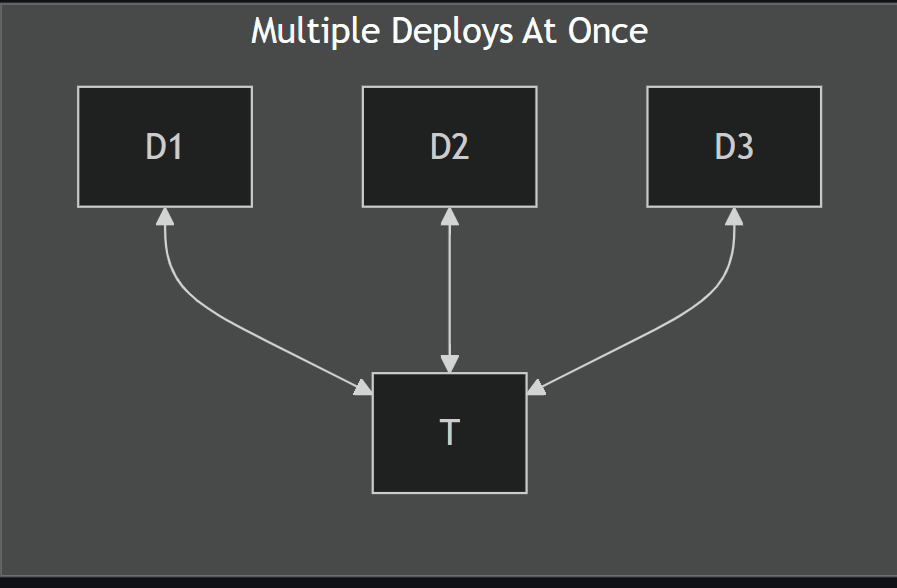
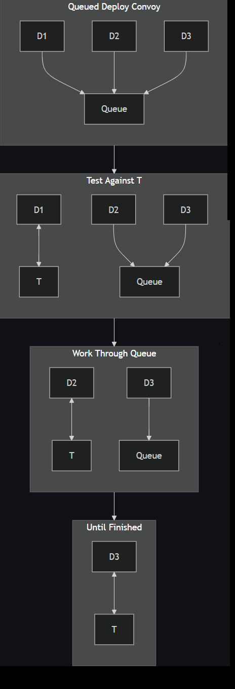
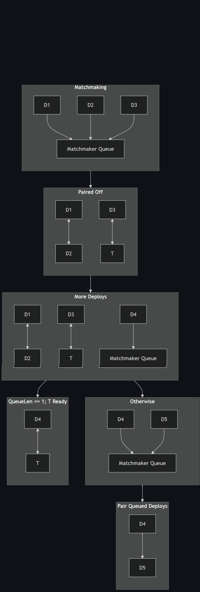

# Network Load Testing

## Contents
- [1. Definitions](#1-definitions)
  - [1.1. What Does "Network" Mean?](#11-what-does-network-mean)
  - [1.2. What's Measured?](#12-whats-measured)
  - [1.3. Traffic Types?](#13-traffic-types)
  - [1.4. When Are the Tests Run?](#14-when-are-the-tests-run)

## 1. Definitions

Load/Perf/Stress/Leak/Availability/Etc. testing is so difficult to define correctly that some professionals specialize in the area.

This doc is primarily concerned with the network versions of those things, but most of this applies equally well to testing services (possibly redundant ones behind a load balancer), apps, OSes, and hardware.

### 1.1. What Does "Network" Mean?

If you're testing an SD-WAN system, for example, does "network" mean "through a tunnel from one point of presence (PoP) to another?" Does it mean "following several tunnel segments?" Does it mean "traffic traveling over more than one competing path? Does it mean your main tunnel path plus one or more failover paths in case of network partitions or degradations?

Does it involve tunnels with different traffic characteristics (speed, lossiness, etc.)?

These are all different scenarios, testing potentially different traffic attributes, so it's a good idea to also define . . .

### 1.2. What's Measured?

If working with a network, this is the place to leverage existing [observability](https://www.honeycomb.io/blog/time-to-version-observability-signs-point-to-yes) (o11y) and monitoring tools. Anything you care to measure for these tests should be usable for ops or anyone debugging a production system, so this is a good place to inform those folks about needs. Conversely, anything ops is measuring may well be something you'll want to measure, too, so you can fill in any test plan gaps you've overlooked.

Some potential things to measure:
- throughput (data/time) from one PoP to another
- server o11y stats (memory/CPU/disk/etc. usage) for PoPs and any other tunnel stops
- number of nodes to serve PoP or load balancer (LB) stats
- different parts of connections' speeds (handshake times over SD-WAN could seem exaggerated, for example, or UDP packet "reordering," depending on tunnel implementation will show up in PoP (tunnel endpoint) characteristics) - I should put that in the next section . . .

### 1.3. Traffic Types?

UDP and TCP are going to behave differently. So are texts vs video streaming vs file downloads.

What types of traffic do you care about? These could be actual customer use cases or could be broken into something lower level and representative . . .

### 1.4. When Are the Tests Run?

The most common answer is "after a deploy happens," but presumably you're diffing results with something. Are you going to diff with the last deploy? What if the network has degraded somehow between the previous deploy and this one? Could be a good idea to test perf before and after a deploy to be sure the deploy didn't cause problems. Or maybe you want to have intermittent (scheduled?) runs with synthetic data to also detect when network degradations have happened. Maybe there are nodes with different characteristics . . . do you want to always test against "worst case scenario?"

And let's assume D is your deploy node and T is a target node you're going to run tests against. Where is T? Is it a permanent test PoP used for this kind of testing? If so, are you ok with [multiple deploying nodes hitting it at once](#141-diagram) (perhaps drastically skewing  results)? Do you queue them up into [a convoy of deploys waiting to test](#142-diagram)? Do you have [a scheme to matchmake, to pair up deploying nodes and test them against one another](#143-diagram) . . . possibly failing two PoPs when there's a problem with only one and also having logic to deal with the odd man out? I'm sure there are other, more complicated ways to deal with this, including managing a stable of test PoPs.

You don't need to figure it all out now, just be aware of tradeoffs to present to other stakeholders.

#### 1.4.1. Diagram

#### 1.4.2. Diagram

#### 1.4.3. Diagram

