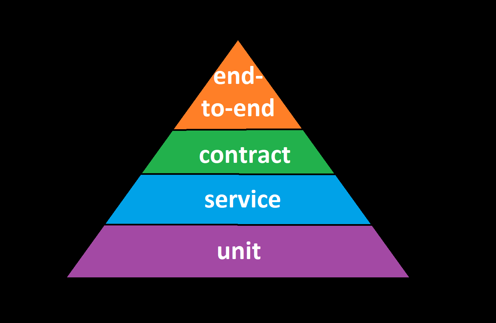

# Test Pyramid

## Contents
- [1. Overview](#1-overview)
- [2. Layers](#2-layers)
  - [2.1. Unit](#21-unit)
  - [2.2. Service](#22-service)
      - [2.2.1. Data Stores](#221-data-stores)
  - [2.3. Contract](#23-contract)
    - [2.3.1. Consumer Changes](231-consumer-changes)
    - [2.3.2. Provider Changes](232-provider-changes)
  - [2.4. End-to-End](#24-end-to-end)
      - [2.4.1. Deployment Tests](241-deployment-tests)
          - [2.4.1.1. Third Party Integrations](2411-third-party-integrations)
      - [2.4.2 Magical Thinking](242-magical-thinking)

## 1. Overview

The [test pyramid](https://martinfowler.com/articles/practical-test-pyramid.html) is a way of organizing and thinking about tests. Especially functional tests.

Smaller, more localized tests give the fastest feedback, have the least work to create/maintain, and are easiest to diagnose. The more integration layers involved, the worse all of those traits are.

These tests also overlap. If we do more of the smaller ones, they'll cover most of what we would have with the larger ones.

That gives us something like this, where there are more unit tests than anything and much fewer end-to-end tests and intermediates between.

## 2. Layers

These tests should ideally run in parallel (cancel-able on error) for any given code change. Let's explore each one, from the bottom up . . .

### 2.1. Unit

Devs should already be writing these.

Ideally, they're tests of functionality (behaviors) instead of implementation.

I don't care whether they include data stores or not - not worried about strict definitions.

### 2.2. Service

These are behavioral tests of the running service plus its data stores in isolation. If the unit tests were already written that way, feel free to skip extra tests in this layer.

Isolate the services by using [test doubles](https://www.martinfowler.com/bliki/TestDouble.html), typically mocks or fakes. If that last sentence doesn't completely make sense, please go read the linked article - it explains better than I would.

The idea here is that we control every possible surface the service talks to. We can send it any signals we like. We can make our fakes respond in any way we like, either happy path or forced unhappy path. This lets us cover all of those error paths that are often impossible to reach with end-to-end testing.

This also allows us to trivially reach 100% code coverage.

>Code Coverage
>
>100% code coverage does not mean that the code is completely tested, but less than 100% coverage means you've definitely missed some code paths.
>
>The main thing to worry about even with 100% coverage is race conditions. Try to reason about them and determine what races are possible. Ideally, they're limited.
>
>If races cannot be determined and reasoned about, you'll have to run stress tests - a desperate act, indeed.
>
>Also worth mentioning is that emergent effects from filter code will not be detected here. Most often fuzzing is the best answer for that. Once reasoning hits a wall, that is.

Also, at service build time, we can do static analysis, which sometimes finds functional and sometimes not.

#### 2.2.1. Data Stores

In the old, bad times, data stores (DBs, file systems, caches, et al.) were often shared. I call shared stores "hidden APIs" because they are (often undefined,) non-explicit communication between two entities (services). In a monolith, this is excusable since a monolith is one big soup of different code and data by definition. But it is an example of [tight coupling](https://en.wikipedia.org/wiki/Coupling_%28computer_programming%29) and an affront to [testablity](https://en.wikipedia.org/wiki/Software_testability#testability-of-software-components).

When data stores are shared, it's important to control the store with tests. Those "hidden APIs" are vectors tests should map out fully and use.

In the 2020s it's common to have shared-nothing services. That means no sharing data stores. Hooray - testability win! In this case, data stores can mostly be seen as an implementation detail. Unless you're worried about integrity of the data store or scoring 100 on your code coverage, those code paths can probably be ignored.

### 2.3. Contract

> What about Integration?
>
> I claim that the future of integration testing is not running multiple services and making them talk (expensive, slow, etc.) but is instead [contract testing](https://pact.io). I've been trying to make it work for over a decade and finally we have our first real orchestration tool!

When one service calls another, they can be said to have a contract - what the interface will be and how it will respond to requests. There's a contract consumer and a contract provider.

Contract tests are intended not to exercise all code paths but to exercise typical API use, both happy and sad path. They test the "shape" of the API.

For any given contract there's a set of consumer calls that result on provider responses. Whichever side is running the test should match the other side's data.

#### 2.3.1. Consumer Changes

When there are code changes in a consumer, we of course run the unit and service tests for the consumer.

Then we run the contract tests. Does this still call an API with the same signature? Does it still deal with the canned responses correctly? If not, the contract tests fail and it's back to work on the consumer.

#### 2.3.2. Provider Changes

When there are code changes on the provider, we again run its unit and service tests.

Then we run contract tests for each of the consumers who call it (possibility to fold them together - I'm leaving out contract "broker" details). If any fail, then again, back to work. This can happen if you change behavior but don't bump a version, for example, or if you cut functionality still used by old callers.

### 2.4. End-to-End

Now we know that everything works as designed, behaves correctly, and integrates with other software. So what's the point of this end-to-end layer?

Not much, actually, which is why it's so small. But there are also things we haven't tested yet.

#### 2.4.1. Deployment Tests

When you deploy, there should be end-to-end tests that make sure the deploying service can talk to logging, monitoring, etc.

> Why Not Smoke Tests?
>
> The term "smoke test" confuses people and I got tired of having to tell the cute "then you'd plug in your breadboard" story. I settled on "deployment tests" because really smoke tests are about when you deploy whether you can talk to all the infra you just plugged into.

##### 2.4.1.1. Third Party Integrations

There should also be checks for integration with live production integrations like SalesForce or payment gateways. This is the first time those can be tested for real with the new code.

#### 2.4.2 Magical Thinking

> _Any sufficiently advanced technology is indistinguishable from magic_
>
>Strangely enough, [Clarke's third law](https://en.wikipedia.org/wiki/Clarke%27s_three_laws) seems to apply to software engineering.

The less understood the system is, the more likely you'll have to deal with magical thinking. Take it very seriously and with a straight face - those concerns are real and those people deserve respect.

My approach to this is to try to minimize those tests. The pushback will be about how they are important for some funnel or for some acceptance criteria. Try to do the least of a given type you can. Make a deal with people, though: offer to add more end-to-end tests if they find bugs but get an agreement you can remove them (or not add future ones) if the rest of the test pyramid catches all of those.

**Deployment tests that integrate with external systems ( e.g. user can log in with the auth provider) are in the 2.4.1.1. bucket. They are not magical thinking.**
