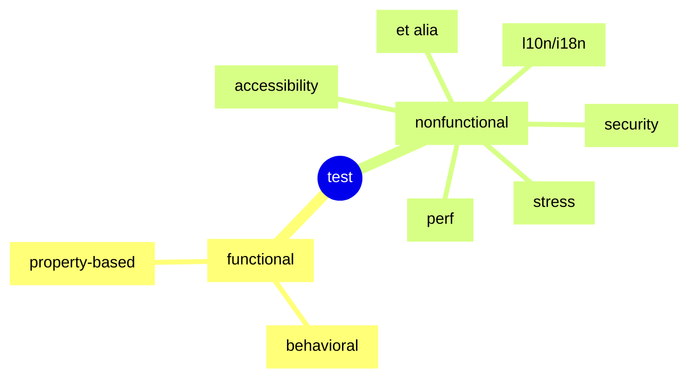

# To a New Manager of a Tester
## Or . . . To a New Tester about to Be Managed

## Contents
- [1. Purpose of Testing](#1-purpose-of-testing)
- [2. Some Basics](#2-some-basics)
  - [2.1. Test Types](#21-test-types)
    - [2.1.1. Property-Based Testing](#211-propertybased-testing)
  - [2.2. Test Pyramid](#22-test-pyramid)
- [3. Useful Tricks](#3-useful-tricks)
  - [3.1. Test Doubles](#31-test-doubles)
  - [3.2. Dependency Injection](#32-dependency-injection)
- [4. Books](#4-books)

# 1. Purpose of Testing

Define this. Make it a goal you can continue to improve upon. Evangelize it. Make sure everyone understands.

Otherwise, testing will be about owning quality, and owning any abstract is a recipe for disaster. Ask any group of people to write down their definitions of quality and you'll get at least as many answers as number of people. The Q-word is a blunt weapon to be used to bash people until they comply or as a blame word whenever anything goes wrong. Either way, it's to be avoided.

Do not accept anything like "ship with zero defects" as a goal. It cannot be improved and if it's achieved you can only count the releases until you backslide. Much like "number of days since last accident" signs, this is more threatening or punishing than it is inspiring.

I typically define test's purpose as feedback to make developers faster. And I want to be judged on dev velocity.

# 2. Some Basics

# 2.1. Test Types

Test lingo varies from one place to another and we often use the same words to mean different things. These are my takes.

[**functional**](https://en.wikipedia.org/wiki/Functional_testing) - tests that treat the code being tested as a function, mapping domains (inputs) to ranges (outputs)

  [**behavioral**]() - tests that describe and verify behaviors of the software under test, often with readable English; I prefer spec-style BDD frameworks (not verbose, high-maintenance [Cucumber/Gherkin!](https://cucumber.io)) like [RSpec](https://rspec.info), [Jest](https://jestjs.io), and [Ginkgo](https://github.com/onsi/ginkgo) - carefully-written [pytest-pspec](https://pypi.org/project/pytest-pspec/) is almost that style

  [**property-based**](211-propertybased-testing) - tests that iterate over combinations - think "forms full of fields" - [see more below](#211-propertybased-testing)

[**non-functional**](https://en.wikipedia.org/wiki/Non-functional_testing) - tests that cannot be modeled as functions - e.g. perf/load/soak/etc., stress, security, accessibility, internationalization and localization, et al.

  [**accessibility**](https://www.section508.gov/test/) - can everyone access your site/app/etc.? Using tooling like [Axe](https://www.deque.com/axe/) makes this much easier

  [**l10n/i18n**](https://www.guru99.com/globalization-vs-localization-testing.html) - localization and internationalization (also sometimes globalization)

  [**perf**](https://en.wikipedia.org/wiki/Software_performance_testing) - performance testing needs more information

  [**security**](https://en.wikipedia.org/wiki/Security_testing) - security testing needs more information

  [**stress**](https://en.wikipedia.org/wiki/Stress_testing) - stress testing needs an explanation of why I don't like it

# 2.1.1. Property-Based Testing

[property-based testing](https://en.wikipedia.org/wiki/Property_testing)

[pairwise or all-pairs testing](https://www.pairwise.org)

# 2.2. Test Pyramid

What functional tests should you have? How many of each? How do you know when it's enough?

See the [test pyramid](../img/test_pyramid.md).

# 3. Useful Tricks

# 3.1. Test Doubles

[test doubles](https://www.martinfowler.com/bliki/TestDouble.html)

# 3.2. Dependency Injection

Miško Hevery used to have a couple of great DI videos on YouTube, but I can't find them now.

# 4. Books

For either a new manager of testers or a new tester, I recommend [_Lessons Learned in Software Testing_](https://www.goodreads.com/book/show/599997.Lessons_Learned_in_Software_Testing). I probably agree with 2/3 of the book and have reasons for disagreements for the other 1/3. It's a quick read with very small "chapters." Sections?

For any new manager or anyone interested in being a manager, I recommend [_Managing Humans_](https://www.goodreads.com/book/show/1317946.Managing_Humans?from_search=true&from_srp=true&qid=JNJnlNLnFW&rank=1). It was originally gathered from a lot of Michael Lopp's blog ["Rands in Repose"](https://randsinrepose.com). Pithy. Practical. And another quick read.

People have thanked me for both of those. And not just because I used to hand out _Lessons Learned_ like candy.
